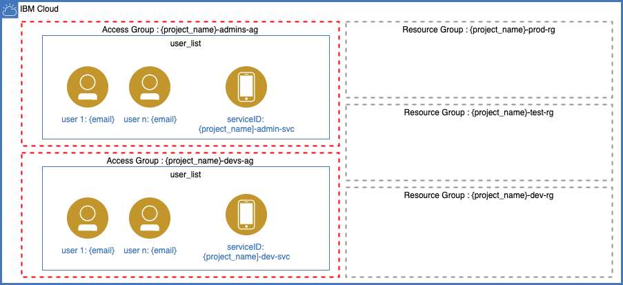

# iam-ibmcloud-terraform

- [iam-ibmcloud-terraform](#iam-ibmcloud-terraform)
  - [Description](#description)
    - [Variables](#variables)
  - [References](#references)

## Description
This terraform script has the purpose of setting the access groups and resource groups for 
starting a new project at IBM Cloud.

 

This terraform script creates:
1. The project resource group.
2. Access group for admins.
3. Access group for developers.
4. Service ID for the project.
5. Resource Group for Admins (Administrator role is assigned)
6. Resource Group for Developers (Editor role is assigned)
7. Service ID Policy for Developers (Editor role is assigned)

### Variables

You can use the iam.auto.tfvars.template to set up your project IAM Model. See the following diagram to understand better what values will be changing and how will they reflect on IBM Cloud IAM.

Here is a relation between the available variables to use:

**ibmcloud_api_key**
: your API key retrieved from IBM Cloud. [See API Keys](https://cloud.ibm.com/iam/apikeys)

**project_name**
: definition

**admins_users**
: definition

**devs_users**
: definition

----------

## References
[IBM Cloud Terrafom Reources - Resource Group](https://cloud.ibm.com/docs/ibm-cloud-provider-for-terraform?topic=ibm-cloud-provider-for-terraform-resource-mgmt-resources#rg)

[IBM Cloud User Roles](https://cloud.ibm.com/docs/account?topic=account-userroles)